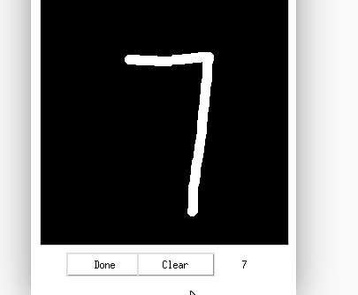

# MINST 手写数据集的训练和识别

训练过程可参考[神经网络Minst手写数字识别](https://aistudio.baidu.com/aistudio/projectdetail/3372290)，里面也提供了自己画图上传识别的办法。

这里的目的做一个画完可以直接识别出来的程序，不需要再导出、上传。

# 画板

画板采用 [tkinter](draw.py) 实现，因为 [matplotlib](drawPlt.py) 实现起来效果不是很理想，当然可以用 pygame、opencv、pyqt5 来实现。

## 效果预览

运行 [程序](draw.py)后会显示黑色画板，鼠标左键绘制，完成后点击 Done 后会在 eval 的位置显示预测结果，点击 clear 清空画布后可重新绘制。

# 参考

- [神经网络Minst手写数字识别](https://aistudio.baidu.com/aistudio/projectdetail/3372290)
- [手写数字识别，分别用Numpy实现和Tensorflow实现全连接神经网络，应用于手写数字画板 ](https://github.com/PyJun/Handwriting_Recognition):pyqt 实现的画板
